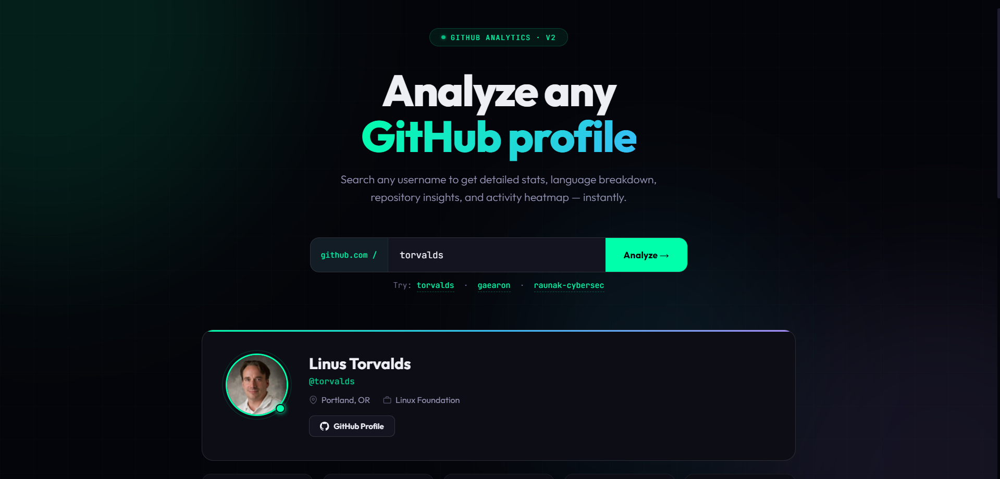

# DevPulse — GitHub Profile Analyzer

A sleek GitHub profile analyzer built with vanilla HTML, CSS, and JavaScript. Search any GitHub username to instantly see their stats, top languages, and best repositories.

## 🔗 Live Demo

[devpulse.vercel.app](https://devpulse.vercel.app) <!-- Replace after deploying on Vercel -->

## 📸 Preview



## ✨ Features

- Search any public GitHub username
- Displays profile info, bio, location, company
- Stats: total repos, followers, following, total stars
- Top languages with animated bar chart
- Top 6 repositories with descriptions and star counts
- Fully responsive — works on mobile and desktop
- Dark theme with subtle grid background

## 🛠️ Built With


## 🚀 Getting Started

No installation or build step needed.

```bash
git clone https://github.com/raunak-cybersec/devpulse.git
cd devpulse
# open index.html in your browser — that's it
```

Or just open `index.html` directly in any browser.

## 📁 Project Structure

```
devpulse/
└── index.html    # entire app in one file
```

## 🌐 Deployment

Deployed on **Vercel** for free — just drag the folder into [vercel.com/new](https://vercel.com/new).

## 👤 Author

**Raunak**
- GitHub: [@raunak-cybersec](https://github.com/raunak-cybersec)
- LinkedIn: [raunak-rai](https://www.linkedin.com/in/raunak-rai-35968b316)
- Email: raunak96963@gmail.com
